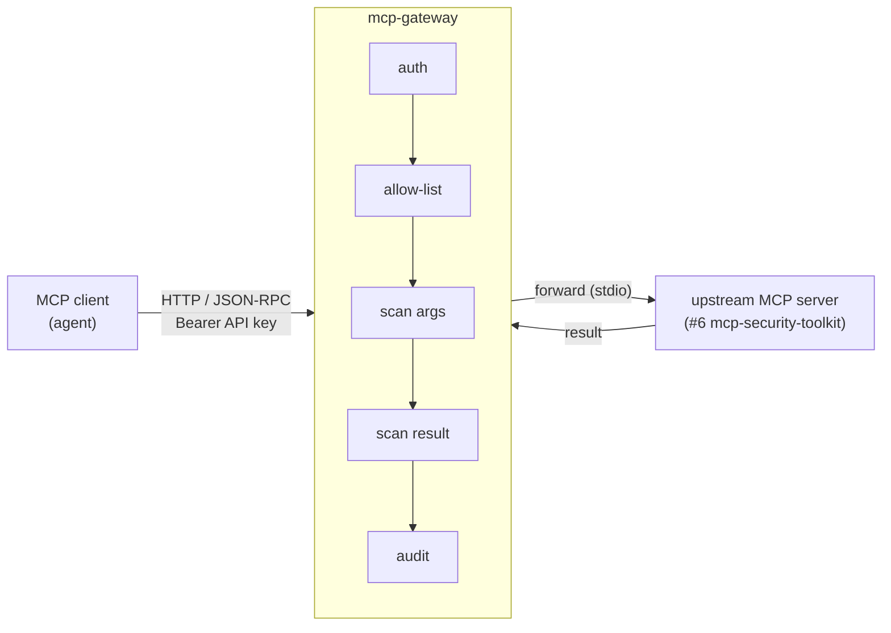

# mcp-gateway

> Project **#9** of the DevSecOps portfolio: a **local, free** security **gateway**
> that sits between an [MCP](https://modelcontextprotocol.io) client and an MCP
> server, enforcing per-client **authentication**, a **tool allow-list**,
> argument/result **scanning**, and an **audit log** — the production defense for
> the "everyone's putting MCP in prod with no security layer" problem.

This is the missing link in the portfolio: **#6** *exposes* tools over MCP, **#7**
shows an agent/MCP setup *is attackable*, and **#9** *(this repo)* is the
**gateway** that stands between them and makes it safe.

| # | Project | Role |
|---|---------|------|
| 1 | secure-k8s-lab | Reproducible cluster + GitOps + isolated vulnerable target |
| 2 | devsecops-pipeline | Scanning in CI (SAST/DAST/deps/IaC) |
| 3 | supply-chain-security | Image + AI-model signing, SBOM, admission control |
| 4 | offensive-writeups | Documented attacks against the lab |
| 5 | runtime-security | Falco + Cilium detecting those attacks |
| 6 | mcp-security-toolkit | Security scanners exposed as MCP tools for AI agents |
| 7 | ai-security-lab | Runtime security of AI/LLM agents (OWASP LLM Top 10) |
| **9** | **mcp-gateway** *(this repo)* | **Security proxy in front of an MCP server: auth + allow-list + scanning + audit** |

## The story this repo tells

> "Teams are wiring MCP servers into production with no security layer — any
> connected agent can call any tool, tool descriptions can carry hidden
> instructions, and secrets leak straight back out. This gateway is the policy
> enforcement point: it authenticates each client, allows only the tools that
> client is entitled to, scans arguments and results, and audits every decision.
> Without it tool poisoning lands; with it, it's blocked and logged."

## What it defends against

| Threat | Defense in the gateway |
|--------|------------------------|
| **Tool poisoning** (hidden instruction in a tool description) | scan `tools/list` descriptions; filter poisoned tools |
| **Confused deputy** (low-priv client calls a power tool) | per-client allow-list, default-deny |
| **Prompt injection** in tool arguments | scan arguments, block on match |
| **Secret / PII leakage** in tool results | scan results, redact before return |
| **No accountability** | append-only JSONL audit of every decision |

## Architecture



Full walk-through in [docs/architecture.md](docs/architecture.md).

## Prerequisites

- [Python](https://www.python.org/) ≥ 3.10
- [uv](https://docs.astral.sh/uv/) — `curl -LsSf https://astral.sh/uv/install.sh | sh`

That's it for the skeleton — no model, no API key, no cloud. (The real upstream
in a follow-up PR is project **#6**, which has its own prerequisites.)

## Quick start — the before/after demo (no AI, free)

```bash
make up      # create the venv + install (uv sync)
make demo    # four MCP attacks, WITHOUT vs THROUGH the gateway, + audit trail
make test    # run the test suite
```

`make demo` prints each attack landing without the gateway and being blocked /
redacted / denied through it, then dumps the audit trail.

## Run it as a server — fronting the real #6

`make serve` spawns project **#6** (mcp-security-toolkit) over stdio and proxies
it, so the gateway now mediates a *real* MCP server's tools:

```bash
make serve                      # http://127.0.0.1:8080/mcp  (spawns #6 on startup)

# admin sees every real tool from #6:
curl -s localhost:8080/mcp -H "Authorization: Bearer dev-admin-key" \
  -d '{"jsonrpc":"2.0","id":1,"method":"tools/list"}'
# -> trivy_fs_scan, gitleaks_scan, checkov_scan, semgrep_scan

# analyst's list is filtered to their allow-list, and calling a tool off it is denied:
curl -s localhost:8080/mcp -H "Authorization: Bearer dev-analyst-key" \
  -d '{"jsonrpc":"2.0","id":1,"method":"tools/call","params":{"name":"checkov_scan","arguments":{"path":"."}}}'
# -> JSON-RPC error: tool 'checkov_scan' not permitted
make audit                      # see the denial recorded
```

Set `MCPGW_UPSTREAM=mock` to run without #6 (the in-process fake). Clients and
their tool allow-lists live in [policy.yaml](policy.yaml) (the dev keys there are
local placeholders, not secrets).

## Repository layout

```
mcp-gateway/
├── pyproject.toml               # uv project: FastAPI + MCP + pyyaml; [guard] = llm-guard
├── policy.yaml                  # client API keys -> tool allow-list (source of truth)
├── src/mcp_gateway/
│   ├── app.py                   # FastAPI: auth -> allow-list -> scan -> forward -> audit
│   ├── config.py                # env-driven settings
│   ├── policy.py                # load policy.yaml, default-deny resolution
│   ├── scanner.py               # arg/result scanning: pattern backstop + llm-guard ([guard])
│   ├── upstream.py              # MockUpstream (offline) + StdioUpstream (proxies #6)
│   └── audit.py                 # append-only JSONL audit log
├── scripts/demo.py              # offline before/after story
├── tests/                       # pytest: auth, allow-list, scanning, poisoning, audit
├── Makefile                     # up / serve / demo / test / audit / down / help
└── docs/architecture.md         # threats, pipeline, portfolio placement, roadmap
```

## Stronger scanning (optional) — llm-guard

The scanner is layered: an always-on **regex backstop** (deterministic, zero-dep)
plus **llm-guard** when you install the optional extra — the same trained defense
as project #7, catching paraphrased/obfuscated prompt injection and PII the regex
misses. It loads lazily and fails open (the backstop still applies).

```bash
uv sync --extra guard     # installs llm-guard (heavy: torch; downloads a model on first scan)
```

## Status

Working: auth, allow-list, **layered scanner (pattern backstop + optional
llm-guard)**, audit, `MockUpstream`, demo, tests, and `StdioUpstream` — the
gateway proxies the real project #6 over stdio. Follow-up: full MCP
streamable-HTTP compliance. See the roadmap in
[docs/architecture.md](docs/architecture.md).

## ⚠️ Note

The dev API keys in `policy.yaml` are **local placeholders** for the demo, not
real credentials. In any real deployment, issue per-client keys out of band, keep
them out of the repo, and put the gateway in front of every MCP server an agent
can reach — an unmediated MCP server is an open door.
