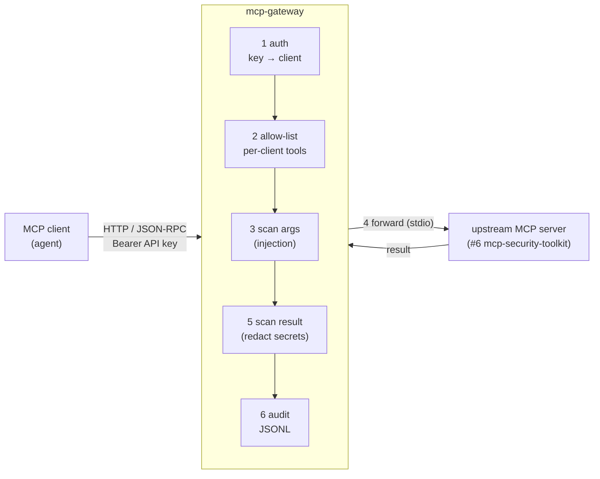

# Architecture

## Why this exists

MCP (the Model Context Protocol) lets an AI agent call **tools** exposed by an
MCP server. In production that connection is wide open: the agent trusts every
tool the server advertises, and the server runs whatever the agent asks. That is
exactly where things go wrong:

- **Tool poisoning** — a malicious server hides instructions inside a tool's
  *description* (which the agent's model reads), hijacking the agent.
- **Confused deputy** — a low-privilege client gets the gateway/agent to use its
  higher privileges to call tools it shouldn't.
- **Injection & leakage** — attacker-controlled arguments carry prompt injection;
  results carry secrets/PII back out.

`mcp-gateway` is the missing **policy enforcement point** that sits between the
client and the server.

## The pipeline

1. **auth** — the `Authorization: Bearer <key>` header resolves to a client via
   `policy.yaml`. Unknown key → `401` (default-deny).
2. **allow-list** — `tools/list` is filtered to the client's tools; `tools/call`
   of a tool not on the allow-list → JSON-RPC error (stops the confused deputy).
3. **scan arguments** — arguments that look like prompt injection are blocked.
4. **forward** — the call is proxied to the upstream MCP server.
5. **scan result** — secrets/PII in the result are redacted before return.
6. **audit** — every decision is appended to `audit.jsonl` (who, what, verdict).

Steps 2/3/5 also cover **tool poisoning**: `tools/list` descriptions are scanned,
and a tool whose description carries a hidden instruction is filtered out.

## Where it sits in the portfolio

- **#6 mcp-security-toolkit** *exposes* tools over MCP.
- **#7 ai-security-lab** shows an agent/MCP setup *is attackable*.
- **#9 mcp-gateway** *(this repo)* is the production **defense** between them.

It reuses #7's defense idea (llm-guard scanning) at the protocol boundary instead
of inside a single agent.

## Implementation

- **Transport** — a real MCP server over **Streamable HTTP**, built on the SDK's
  low-level `Server` + `StreamableHTTPSessionManager` (no hand-rolled JSON-RPC).
  A Starlette ASGI shim authenticates the `Authorization: Bearer` key to a client
  and stashes it in a context var the tool handlers read. So Claude Code / Cline
  connect with a key, exactly as to any MCP server.
- **`GatewayCore`** (`gateway.py`) — the transport-agnostic security pipeline
  (allow-list → scan args → forward → redact result → audit). The HTTP layer, the
  offline demo and the unit tests all drive this same core.
- **Upstream** — `StdioUpstream` spawns project #6 over stdio and proxies it via
  the MCP client SDK (one persistent session, opened in the app lifespan);
  `MockUpstream` is the offline fake (with a poisoned tool) for the demo/tests.
- **Scanner** — a deterministic regex backstop plus **llm-guard** (PromptInjection
  on input, Sensitive/PII on output, the same defense as #7) under the optional
  `guard` extra, lazily loaded and fail-open.
